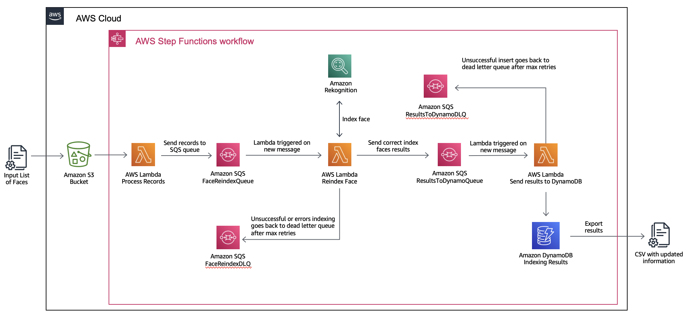
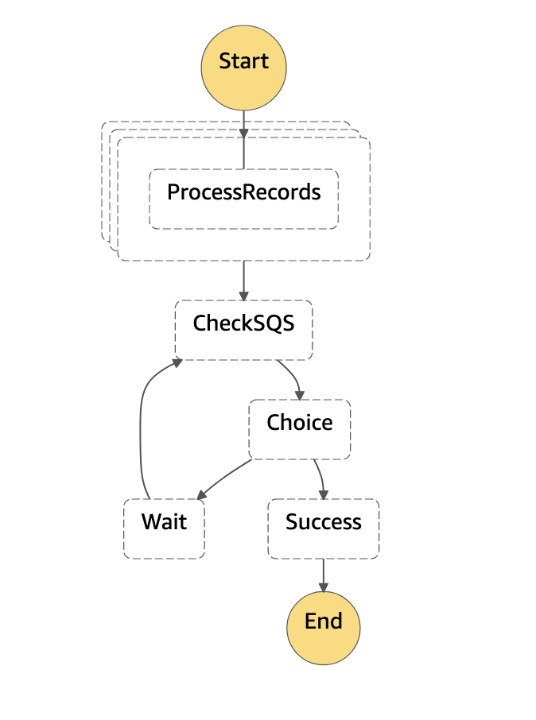

# Amazon Rekognition Face Collection ReIndexing Solution

This solution allows customers to migrate their Amazon Rekognition face collections to the newest FaceModelVersion available. 

The solution is already packaged into an Amazon CloudFormation template. AWS CloudFormation is a service that helps you model and set up your AWS resources so that you can spend less time managing those resources and more time focusing on your applications that run in AWS. 

### Solution Architecture



## Solution Deployment

### Configure your Amazon SageMaker Studio Environment
To configure and deploy the solution we have created a Jupyter Notebook containing all the needed steps. Amazon Sagemaker
Studio allows you to access fully managed Jupyter notebooks. If you don't have an existing Studio environment, you can follow
the instructions in [this guide](https://catalog.us-east-1.prod.workshops.aws/workshops/63069e26-921c-4ce1-9cc7-dd882ff62575/en-US/prerequisites/option2). 

### Download this repository
When you have your environment ready, open a new Terminal and type the following command:

```git clone https://github.com/aws-samples/amazon-rekognition-reindexing-solution.git```

In the File Browser you should see an **assets** folder and a notebook named **0-Data-Preparation.ipynb**.

Open the notebook to prepare your face collection dataset, once finished, open **1-ReIndex-Solution.ipynb** to deploy and launch the reindex solution.

## Solution Walkthrough

### Data Preparation

The first step of the solution is to prepare your face collection data. We provide a notebook which helps you gather your faceid records and merge it with the S3 bucket and key of the image used originally to index the faces. At the end of the notebook, your records will be sent to Amazon S3 ready to be sent to the reindexing process. 

Data records should adhere to the following structure for the reindexing solution to function correctly:
```
[
    {
        "Bucket": String,
        "Key": String,
        "ExternalImageId": String,
        "CollectionId": String,
        "Faces": [
            {
            "UserId": String, // Optional
            "FaceId": String,
            "ImageId": String,
            "BoundingBoxes": {
                "Width": Float,
                "Height": Float,
                "Left": Float,
                "Top": Float
                }
            }
        ]
    }
]   
```

### Solution Deployment and Re-index Kickoff

The solution is already packaged into an Amazon CloudFormation template. AWS CloudFormation is a service that helps you model and set up your AWS resources so that you can spend less time managing those resources and more time focusing on your applications that run in AWS. We provide you a Jupyter Notebook to automatically deploy the solution and kick off the reindexing process by starting an AWS Step Functions execution passing in the records uploaded to Amazon S3 in the previous notebook. 

The entry point will be an Amazon SQS queue which will receive and store the messages to be processed. 

The Step Functions state machine manages a workflow which breaks down into the following steps:

* **File Analysis:** The state machine receives the JSON file from S3, splits it into X items and triggers AWS Lambdas to process the batches of records. 
* **ProcessRecords:** The processing lambda reads the records and sends them to the FaceReindexQueue.
* **CheckSQS:** The state machine checks if the SQS are empty to finalise the execution. 




### Index the faces into the new face collection 

The next stage of the solution covers the process of indexing the faces into a new face collection using the updated Face Model Version. As messages arrive to the Amazon SQS queue, AWS Lambda functions will be triggered to index the face into the new collection. 

AWS Lambda is a compute service that lets you run code without provisioning or managing servers. Lambda runs your code on a high-availability compute infrastructure and performs all of the administration of the compute resources, including server and operating system maintenance, capacity provisioning and automatic scaling, and logging. With Lambda, you can run code for virtually any type of application or backend service. All you need to do is supply your code in one of the languages that Lambda supports.

When working at large scale, we need to keep in mind the concurrency and TPS limits of the services we are using. Here is the list of Amazon Rekognition default limitsper API for every region. As we are going to use the IndexFace API, we need to limit the number of AWS Lambdas which process messages from the SQS queue at the same time. To achieve this, we are going to match the TPS limit to the SQS Maximum Lambda concurrency. This feature controls the maximum number of concurrent Lambda functions invoked by Amazon SQS as an event source.


We also need to verify we are re-indexing the same face. Rekognition Face Models improve over time and may provide better bounding boxes coordinates or detect more faces in the same image. To make sure we are indexing the same face we can use Intersection Over Union, which will measure the overlap between the old and new bounding boxes. If the percentage of overlap overcomes the threshold set, we can assume it is the same face. Records which don’t meet the threshold, or no faces are found will be sent to a Dead Letter Queuewhere customers can review manually. 

### Store the updated information

The last stage of the solution is designed to store the output and updated data into a datastore. In this case we are inserting the data into Amazon DynamoDB, which can later on be exported as a CSV file for internal processing. 

Amazon DynamoDB is a fully managed NoSQL database service that provides fast and predictable performance with seamless scalability. DynamoDB lets you offload the administrative burdens of operating and scaling a distributed database so that you don't have to worry about hardware provisioning, setup and configuration, replication, software patching, or cluster scaling.

The process is similar to the previous stage. Successful indexing messages will arrive to the Amazon SQS queue in charge of sending the results to our DynamoDB table. Amazon Lambda functions will be triggered upon arrival and where data will be inserted into the table using the DynamoDB boto3 client. If there is any error during the lambda execution, the message will be moved to a dead letter queue for manual revision. 

Here are the fields you will get back to process internally:

**UserID:**	Unique identifier that the customer assigned to a user, which is  internally mapped to a FaceId.

**FaceId:**	Unique identifier that Amazon Rekognition assigned to the face.

**OldFaceId:**	FaceId assigned in the older version collection.

**ImageId:**	Unique identifier that Amazon Rekognition assigned to the input  image.

**OldImageId:**	ImageId assigned in the older version collection.

**ExternalImageId:**	Identifier the customer assigned to the face in the input image.

**Bucket:**	Name of the Amazon S3 bucket where the user image is located.

**File:**	Name of the Amazon S3 key which refers to the photo in the bucket. 

Once all the re-indexing messages have been processed you can head over to your dynamo table and download your items as a CSV file or export your table to Amazon S3. 


## Security

See [CONTRIBUTING](CONTRIBUTING.md#security-issue-notifications) for more information.

## License

This library is licensed under the MIT-0 License. See the LICENSE file.
