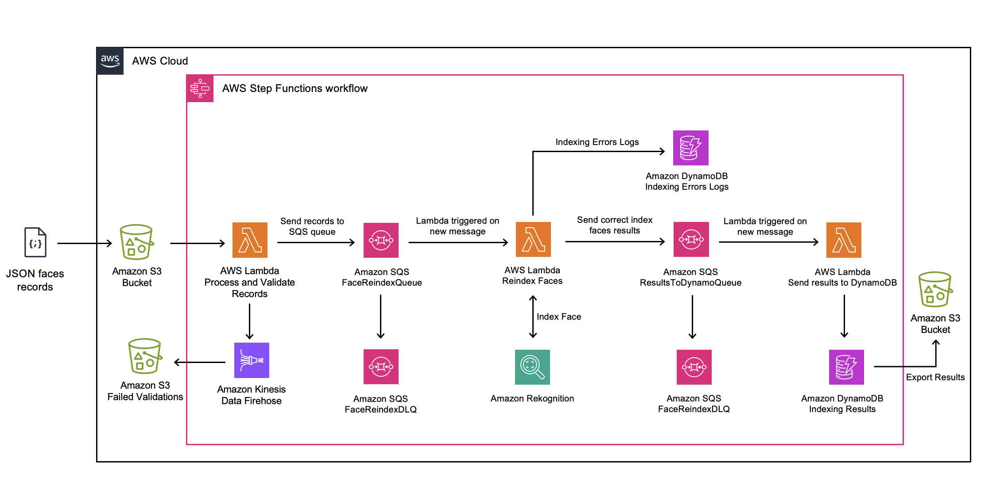

# Amazon Rekognition Face Collection ReIndexing Solution

#### TL;DR: This solution allows customers to migrate their Amazon Rekognition face collections to the newest FaceModelVersion available.

Face Collections is an Amazon Rekognition feature, which simplifies the management of face data for facial recognition tasks. These collections enable users to create and index sets of unique faces, allowing for efficient searching and comparison of faces within a collection or against stored faces. 

Face Collections find applications in user authentication, identity verification, and organizing visual content based on detected individuals. The integration of Face Collections with other AWS services, along with its ability to search and compare faces, makes it a versatile tool for building scalable solutions in various domains, from security systems to content management and analysis.

### Solution Architecture



## Solution Deployment

The solution is already packaged into an AWS CloudFormation template. AWS CloudFormation is a service that helps you model and set up your AWS resources so that you can spend less time managing those resources and more time focusing on your applications that run in AWS. 

Launch one of the following AWS CloudFormation Templates in your account (The link will automatically open the AWS CloudFormation console). 
- [Launch solution in N.Virginia - us-east-1](https://us-east-1.console.aws.amazon.com/cloudformation/home?region=us-east-1#/stacks/create/review?templateURL=https://rkra-us-east-1.s3.us-east-1.amazonaws.com/assets/template.yaml&stackName=remember-only-lowercase&unique)
- [Launch solution in Oregon - us-west-2](https://us-west-2.console.aws.amazon.com/cloudformation/home?region=us-west-2#/stacks/create/review?templateURL=https://rkra-us-west-2.s3.us-west-2.amazonaws.com/assets/template.yaml&stackName=remember-only-lowercase&unique)
- [Launch solution in Ireland - eu-west-1](https://eu-west-1.console.aws.amazon.com/cloudformation/home?region=eu-west-1#/stacks/create/review?templateURL=https://rkra-eu-west-1.s3.eu-west-1.amazonaws.com/assets/template.yaml&stackName=remember-only-lowercase&unique)

You will need to specify the following parameters in the template:

1. **Template name:** A name for the template. Resources will include this name in their resource name, 🔴 **make sure it is unique and lowercase** 🔴.  
2. **Rekognition IndexFaces TPS Limit:** Transactions Per Second (TPS) are most relevant at the peak of an expected workload. Default TPS is 50, but you can reach out to AWS to have this limit increased. This value matched the concurrent Lambda functions in charge of reindexing a collection. 
3. **LambdaMaxConcurrencyAvailable:** Specify your Lambda Concurrency Quota for your account. This will speed up the process. **Max Value is 10000**.
4. **Rekognition IndexFaces Quality Filter:** A filter that specifies a quality bar for how much filtering is done to identify faces. Filtered faces aren't indexed. If you specify AUTO, Amazon Rekognition chooses the quality bar. If you specify LOW, MEDIUM, or HIGH, filtering removes all faces that don?t meet the chosen quality bar. The default value is AUTO.

Wait until the service finishes deploying the template provided. Head over to the **Outputs** tab in AWS CloudFormation to find the link to a new Amazon S3 bucket created.

## Launch a new indexing process

### Expected data format 

The solution will take in as input your face collection data as a JSON file. The file will contain a list of records containing the information about the original pictures and indexed faces. 

Data records should adhere to the following structure for the reindexing solution to function correctly:

```
[ #List of Images
    { #Image1
        "Bucket": String,
        "Key": String,
        "ExternalImageId": String, #Optional value 
        "CollectionId": String, #Name of the new collection to store faces into
        "Faces": [ #List of original indexed faces in Image1
          {                         
            "UserId": String, #Optional value
            "FaceId": String,
            "ImageId": String,
            "BoundingBoxes": {
              "Width": Float,
              "Height": Float,
              "Left": Float,
              "Top": Float
            }
          }
        ]
    }
]      
```

You can retrieve most of the information using the Rekognition ListFaces() function. You also have available a Jupyter Notebook in the **helper modules** folder to help you prepare this data.

### Indexing process kickoff

**🔴 IMPORTANT PREREQUISITES BEFORE LAUNCHING AN INDEXING PROCESS🔴**

* **You need to create a folder named "records" inside the Amazon S3 bucket.**
* **You need to previously create the new collections where faces will be indexed.** 

Once you have deployed the solution and prepared your face records following the structure in the step above, you are ready to begin a reindexing process. You only need to upload your JSON file to the records folder inside the generated Amazon S3 bucket. Once the file lands inside the bucket a new Step Functions state machine will be triggered. 

### Indexing Results

Information regarding each reindex operation will be stored into Amazon DynamoDB table, which can later on be exported as a CSV file for internal processing. If any errors occur during the indexing will also be stored a logs table for easy review. 

## Other sections 

Here is a list of additional sections included in this repository:

* **Helper Modules:** We have created a notebook to help you create the records file. 
* **Documentation:** Details about the reindexing process

## Security

See [CONTRIBUTING](CONTRIBUTING.md#security-issue-notifications) for more information.

## License

This library is licensed under the MIT-0 License. See the LICENSE file.
