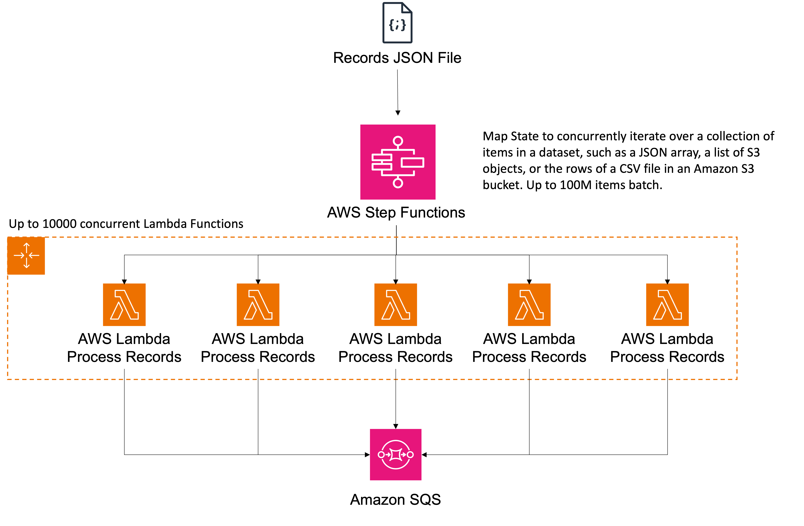
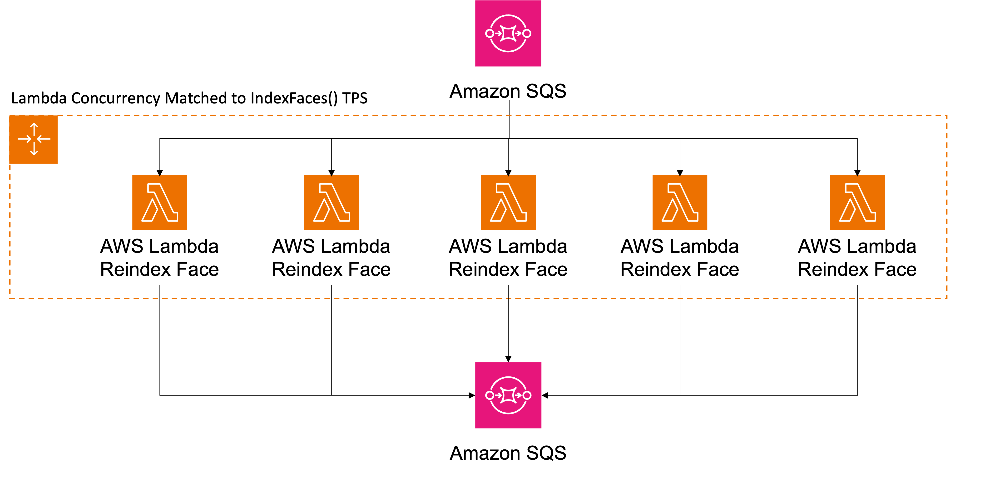

# ReIndexing Solution — Documentation

The goal of this document is to do an end-to-end walk-through of the re-indexing solution.

## Purpose Of The Solution 

At the time of creating this solution, customers have to manually upgrade their populated face collections to take advantage of the newer FaceModel’s accuracy. This means they will need to create a new collection and re-index all the faces from their current collection. It's worth noting that for those dealing with hundreds of faces, a small script can expedite the process efficiently. However, when operating at a larger scale involving thousands or even millions of faces, the task becomes considerably more time-consuming and complex.

In order to streamline this procedure and leverage the scalability offered by AWS, we've created a publicly available solution. This solution facilitates a smooth migration for customers, enabling them to effortlessly transition their existing face collections to the latest available face model version. 

## Deployment  Guide

The deployment guide of the solution can be found at the root of the [repository.](https://github.com/aws-samples/amazon-rekognition-reindexing-solution) 

## Architecture Diagram

Below is the architecture diagram of the solution: 

## Solution Walk-Through

### Input dataset

The solution will take in as input your actual face collection data as a JSON file. The file contains a list of records regarding the information about the original pictures and the corresponding indexed faces. Rekognition ListFaces() function returns most of the data required to create your records file. You will need to map each face to the original image in Amazon S3 used for the indexing. 

#### Expected Format

Data records should adhere to the following structure for the indexing process to function correctly:

```
[ #List of 1:N Images
    { #Image1
        "Bucket": String,
        "Key": String,
        "ExternalImageId": String,
        "CollectionId": String, #Name of the new collection to store faces into
        "Faces": [ #List of original indexed faces in Image1
          {                         
            "UserId": String, #Optional
            "FaceId": String,
            "ImageId": String,
            "BoundingBoxes": {
              "Width": Float,
              "Height": Float,
              "Left": Float,
              "Top": Float
            }
          }
        ]
    }
]   
```

#### Data Preparation — Jupyter Notebook

We have created a notebook which will help you create your face collection data in the expected format for the reindexing solution. You will need to implement the code for the **getAdditionalInfo function** to retrieve the Bucket and Key of the image used for the face index. If you also have mapped an internal userId you can also include it optionally.

You can find the notebook in the helper-modules section.

#### Solution Kick-Off

Once you have prepared your dataset in the correct format, you will need to upload the file to the Amazon S3 bucket created by the AWS CloudFormation template. You will need to place the json file in a folder named **records** to trigger a new AWS Step Functions workflow in charge of the reindexing process. 

### Processing the input dataset

The input dataset can range from hundreds to millions of records, which means we need to introduce parallelism to process the file in an efficient way. To achieve this we are going to use AWS Step Functions, which allows you to orchestrate complex tasks seamlessly.

The AWS Step Functions service introduces the Map state, a powerful feature tailored for scenarios demanding parallelized operations across a collection or list of elements. In our solution, the Map state is strategically configured to handle JSON files with a substantial volume—up to 100 million records. 

These records undergo processing through the dedicated Processor Lambda function, which divides the record batch and dispatches them to the designated Amazon SQS Queue named FaceReindexQueue. The brilliance of this setup lies in the concurrent execution of up to 10000 Lambdas, optimizing the processing efficiency and significantly expediting the overall workflow. 


### Processing the Re-index Queue

The subsequent phase of the state machine focuses on the critical process of indexing faces into a new face collection, leveraging the updated Face Model Version. As messages populate the FaceReindexQueue, AWS Lambda functions, specifically ReIndexing Function, spring into action, orchestrating the indexing of faces into the designated collection. 

However, when operating at a large scale, careful consideration must be given to the transactions per second (TPS) limits imposed by Amazon Rekognition APIs. As we will use IndexFace API (TPS default value is 50), we need to limit the number of AWS Lambdas which process messages from the SQS queue concurrently. To achieve this, we will match the TPS limit to the SQS Maximum Lambda concurrency. This feature controls the maximum number of concurrent Lambda functions invoked by Amazon SQS as an event source.

If you increase the Rekognition TPS limit, check out this blog on [how to increase the SQS Maximum Lambda concurrency.](https://aws.amazon.com/blogs/compute/introducing-maximum-concurrency-of-aws-lambda-functions-when-using-amazon-sqs-as-an-event-source/)  


#### Analyzing and comparing the new indexed faces

It's crucial to confirm that we are re-indexing the identical face in the Reindex Face Lambda function. As Rekognition Face Models enhance their accuracy over time, they might offer improved bounding box coordinates or identify more faces within the same image. To ensure consistency in indexing the same face, we can employ Intersection Over Union. This metric measures the overlap between the previous and current bounding boxes. If the overlap percentage surpasses the designated threshold, we can reasonably conclude that it is the same face. 

Any records failing to meet the threshold or instances where no faces are detected will be logged into DynamoDB for further reference.


### Store the solution output

The final phase of the solution revolves around storing the processed output and updated data in a designated data store. Specifically, we use Amazon DynamoDB for data insertion, and subsequently, this data can be extracted as a CSV file for internal processing or exported to Amazon S3. For the operational flow, successfully indexed records are directed to an Amazon SQS queue responsible for transmitting results to the corresponding DynamoDB table. Upon arrival, Amazon Lambda functions are triggered to insert data into the DynamoDB table. 

The data will arrive in DynamoDB structured in the following way:

**UserID**: Unique identifier assigned by the customer to a user, internally mapped to a FaceId.
**FaceId**: Unique identifier assigned by Amazon Rekognition to the face.
**OldFaceId**: FaceId assigned in the older version collection.
**ImageId**: Unique identifier assigned by Amazon Rekognition to the input image.
**OldImageId**: ImageId assigned in the older version collection.
**ExternalImageId**: Identifier assigned by the customer to the face in the input image.
**Bucket**: Name of the Amazon S3 bucket containing the user image.
**File**: Name of the Amazon S3 key referring to the photo in the bucket.


